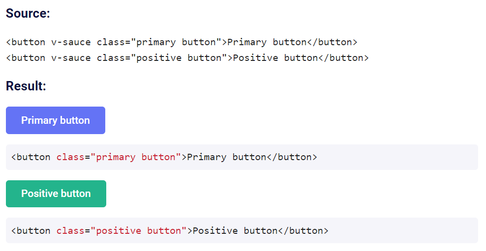

# 🍝 vue-sauce

> "View source" (😬) directive for Vue.

https://botre.github.io/vue-sauce/

## About

Automatically append up-to-date html documentation to your elements.



## Installation

```bash
npm install --save vue-sauce
```

[npm package link](https://www.npmjs.com/package/vue-sauce)

```javascript
import Vue from 'vue';
import sauce from 'vue-sauce';
Vue.directive('sauce', sauce);
```

Simply add v-sauce to the element you want to document.

Example: https://botre.github.io/vue-sauce/

## Powered by

- Babel
- Webpack 4

## License

[MIT](http://opensource.org/licenses/MIT)

## Twitter

[Follow me on Twitter](https://twitter.com/KrolsBjorn)
